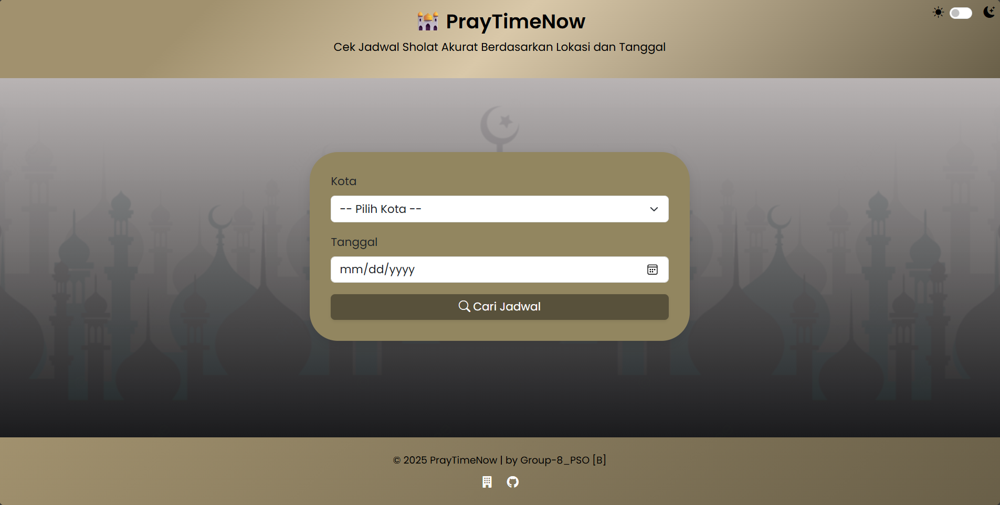
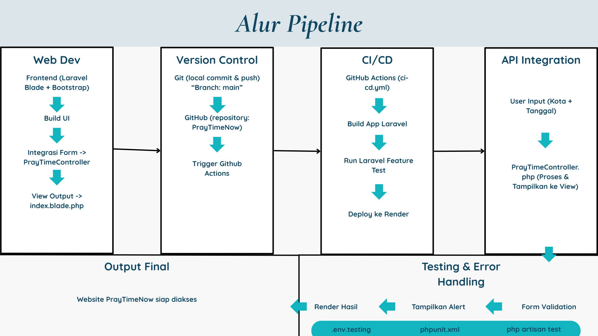

# 🕌 PrayTimeNow



Aplikasi web ringan yang menyajikan jadwal sholat harian berdasarkan kota dan tanggal pilihan. Tidak memerlukan login, instalasi, atau GPS. Dibangun dengan Laravel, Bootstrap, dan pipeline CI/CD menggunakan GitHub Actions + Docker. Dihosting secara otomatis di [Render](https://praytimenow.onrender.com/).

<a href="https://docs.google.com/document/d/1IJQIoLhO2UW8teHe6qSYFJGRPyrvBX8itr1tTfiAxg4/edit?usp=sharing"> > Detailed Documention. </a>

---

## 🌟 Fitur Utama

-   🎯 **Pencarian Jadwal Sholat**
    Cek waktu sholat 5 waktu berdasarkan lokasi dan tanggal input.

-   🌐 **Dropdown Pilihan Kota**
    Memuat nama-nama ibu kota di Indonesia secara otomatis dari file JSON.

-   🌙 **Mode Gelap & Terang Otomatis**
    Dapat diganti secara instan melalui toggle UI.

-   🕒 **Countdown Sholat Selanjutnya**
    Hitung mundur ke waktu sholat berikutnya secara real-time.

-   ⚙️ **Tanpa Login / Registrasi**
    Cukup buka website, masukkan kota dan tanggal, langsung tampil hasil.

---

## 🧱 Teknologi yang Digunakan

### Backend

-   **Laravel 10**
-   **PHP 8.2**
-   **Blade Template Engine**

### Frontend

-   **Bootstrap 5**
-   **Bootstrap Icons**
-   **Google Fonts: Poppins**

### CI/CD & Deployment

-   **Docker** – Image Laravel + Apache
-   **GitHub Actions** – Workflow otomatis (CI test, build, deploy)
-   **Render.com** – Cloud hosting untuk aplikasi

### API yang digunakan

-   **Aladhan API** – Untuk jadwal sholat
-   **Nominatim API** – Untuk geocoding kota input

---

## 📂 Struktur Utama Repository

```
PrayTimeNow/
├── app/
│   └── Http/Controllers/PrayTimeController.php
├── public/
│   └── images/masjid.png
├── resources/
│   ├── views/pray/index.blade.php
│   └── data/cities.json
├── routes/web.php
├── tests/Feature/PrayTimeFeatureTest.php
├── Dockerfile
├── .env
├── phpunit.xml
├── .github/
│   └── workflows/ci-cd.yml
└── README.md
```

---

## 🚀 Alur CI/CD Pipeline



### 🧪 Continuous Integration (CI)

Setiap push ke branch `main` akan memicu:

-   Install dependencies dengan `composer install`
-   Jalankan Laravel Feature Test (`php artisan test --testsuite=Feature`)
-   Validasi environment file, key, dan Laravel version

### 🏗️ Continuous Deployment (CD)

-   Push image ke Render
-   Menjalankan container Laravel
-   Otomatis melakukan deploy dari branch utama setelah test sukses

---

## 🧪 Testing

Pengujian dilakukan melalui Laravel Feature Test (`tests/Feature/PrayTimeFeatureTest.php`), meliputi:

-   Akses ke homepage (`/`)
-   Validasi form input (kota dan tanggal)
-   Simulasi input valid dan pengecekan konten respon

Contoh:

```php
public function homepage_is_accessible()
{
    $response = $this->get('/');
    $response->assertStatus(200);
    $response->assertSeeText('Cari Jadwal');
}
```

---

## ⚙️ Konfigurasi Environment

### 📄 `.env` (Production)

```env
APP_NAME=PrayTimeNow
APP_ENV=local
APP_KEY=base64:xxxxxxxxxxxxxx
APP_DEBUG=true
APP_URL=https://praytimenow.onrender.com

DB_CONNECTION=none
SESSION_DRIVER=cookie
CACHE_DRIVER=array
QUEUE_CONNECTION=sync
```

### 📄 `phpunit.xml` (Testing)

```xml
<env name="APP_ENV" value="testing"/>
<env name="DB_CONNECTION" value="sqlite"/>
<env name="DB_DATABASE" value=":memory:"/>
<env name="SESSION_DRIVER" value="array"/>
<env name="CACHE_DRIVER" value="array"/>
```

---

## 🌐 Demo Aplikasi

🖥️ URL: [https://praytimenow.onrender.com](https://praytimenow.onrender.com)

---

## 💻 Cara Menjalankan Lokal

```bash
# Clone project
git clone https://github.com/mas663/PrayTimeNow.git
cd PrayTimeNow

# Jalankan Docker
docker build -t praytimenow .
docker run -p 8080:80 praytimenow
```

---

## 🧩 Catatan Pengembangan

-   ✅ Sinkronisasi APP_KEY di `.env` dan `phpunit.xml`
-   ✅ Perbaikan permission Laravel (`chmod storage`, `chown www-data`)
-   ✅ Penyesuaian `Dockerfile` untuk build dan config
-   ✅ Pembuatan endpoint `/debug` untuk validasi APP config saat runtime
-   ✅ Penambahan dropdown dinamis kota dari file JSON (`cities.json`)

---

## 🤝 Kontributor

Kelompok 8 - PSO \[B]:

-   Rosdiani Adiningsih (5026221101)
-   Mohammad Affan Shofi (5026221134)
-   Alexander Satryo Pinandhito (5026221135)
-   Airlangga Bayu Taqwa (5026221204)
